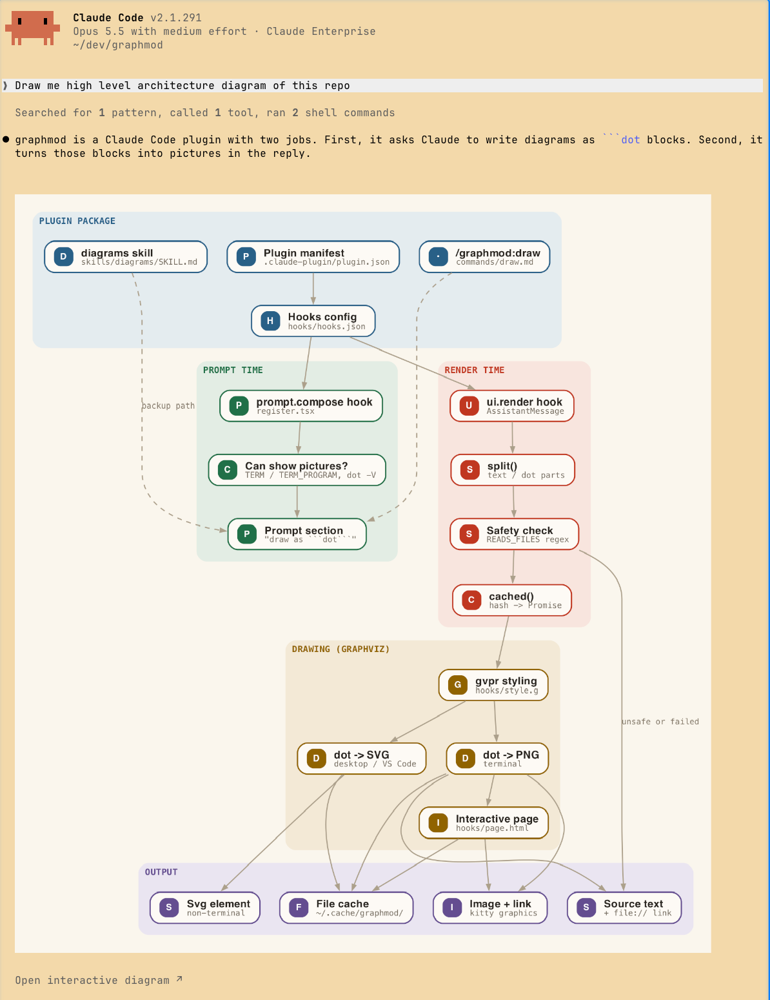

<p align="center">
  <picture>
    <source media="(prefers-color-scheme: dark)" srcset="docs/logo/logo-dark.svg">
    
  </picture>
</p>

# graphmod

A [Claude Code](https://claude.com/claude-code) mod that turns diagrams in Claude's replies into real pictures.

You ask:

```
❯ draw me the high level architecture of graphmod
```

and the reply shows this, right in the terminal:



## How it works

1. It adds a short section to the system prompt: "draw diagrams as a ```` ```dot ```` (Graphviz) block, not ASCII art",
   with labels written as `"Title\nshort detail"` and layers grouped in clusters.
2. When a reply has a closed ```` ```dot ```` block, it styles the graph and draws it:
   - `gvpr` (part of Graphviz) runs `hooks/style.g`: each cluster gets its own color and a tinted
     background, and each box becomes a card with a colored badge, a bold title and a small monospace
     second line. If `gvpr` fails, the graph is drawn with the plain style;
   - terminal with pictures (Ghostty, cmux, kitty, WezTerm): a PNG `Image`, and under it an
     "Open interactive diagram" link;
   - desktop app / VS Code / mobile: an `Svg`.
3. Text around the diagram is drawn by Claude Code as usual. If `dot` fails, you see the source block.
   `ctrl+o` always shows the original reply text.

### The skill and the `/graphmod:draw` command

The prompt section is added only when the mod's hooks load. As a second path, the plugin also ships:

- the `diagrams` skill (`skills/diagrams/SKILL.md`): its description is always in Claude's context and says
  "draw diagrams as a ```` ```dot ```` block", so Claude uses `dot` even in a session where the prompt section is missing;
- the `/graphmod:draw [what]` command (`commands/draw.md`): draws the given thing as `dot`. With no argument it
  redraws the diagrams of the last reply as `dot`.

The skill does not draw anything itself. If the mod did not load, a `dot` block is shown as source text.

### The interactive page

The link opens an HTML page in your browser. Hover a box to highlight its lines and neighbors,
click to pin it, drag to move, scroll (or `+` / `−`) to zoom, `Fit` to reset.

PNG, SVG and HTML files are cached in `~/.cache/graphmod/` by content hash.

### Terminals without pictures

Pictures in a terminal need the kitty graphics protocol. The mod checks `TERM_PROGRAM` (`ghostty`, `WezTerm`)
and `TERM` (`xterm-kitty`, `xterm-ghostty`). Anywhere else (Terminal.app, tmux, ssh):

- the system prompt section is not added, so Claude draws diagrams as before;
- a `dot` block that still appears is shown as source, with an "Open the diagram" `file://` link to the
  interactive page.

### Safety

The mod runs only `mkdir`, `gvpr` (with its own `hooks/style.g`) and `dot`, and writes files only in
`~/.cache/graphmod/`. It has no network access. The interactive page is one self-contained file with a
Content Security Policy that blocks all network requests, and links from the dot source (`URL=`, `href=`)
are removed from it. The `dot` source comes from Claude's reply, so a
block that would make `dot` read local files (`image=`, `shapefile=`, `imagepath=`, `fontpath=`, or an HTML-label
``) is shown as text and not rendered.

## Requirements

- Claude Code with mods (function hooks) support. Built and tested on `2.1.289`.
  Mods are an early feature; the API may change between Claude Code releases.
- Graphviz, with `dot` and `gvpr` on `PATH`: `brew install graphviz`

## Install

This repo is a plugin marketplace with one plugin. Inside Claude Code:

```
/plugin marketplace add ybonda/graphmod
/plugin install graphmod@graphmod
```

Or from a shell:

```
claude plugin marketplace add ybonda/graphmod
claude plugin install graphmod@graphmod
```

Start a new session after installing.

### Update

```
claude plugin marketplace update graphmod
claude plugin update graphmod@graphmod
```

Then run `/reload-plugins` in an open session.

### Uninstall

```
claude plugin uninstall graphmod@graphmod
claude plugin marketplace remove graphmod
```

## Develop

Load a local clone for one session:

```
claude --plugin-dir ~/dev/graphmod
```

Check and test:

```
claude plugin validate ~/dev/graphmod
claude plugin test ~/dev/graphmod
```

The engine writes type declarations into `.claude-plugin/types/` on every load (git-ignored); after one load,
`npx -p typescript tsc -p ~/dev/graphmod` type-checks the mod (the root `tsconfig.json` extends that file).

## Layout

```
.claude-plugin/plugin.json       plugin manifest
.claude-plugin/marketplace.json  one-plugin marketplace ("source": "./")
hooks/hooks.json                 names the hooks module
hooks/register.tsx               the mod: prompt.compose + ui.render(AssistantMessage)
hooks/style.g                    gvpr script: cluster colors and card labels
hooks/page.html                  template of the interactive page
skills/diagrams/SKILL.md         skill: "draw diagrams as dot" (same rules as the prompt section)
commands/draw.md                 /graphmod:draw command
tests/graphmod.test.ts           claude plugin test suite
docs/demo.png                    the picture above
docs/logo/                       logo: mark, wordmark, dark and one-color versions, small icons
```

## License

[MIT](LICENSE)
